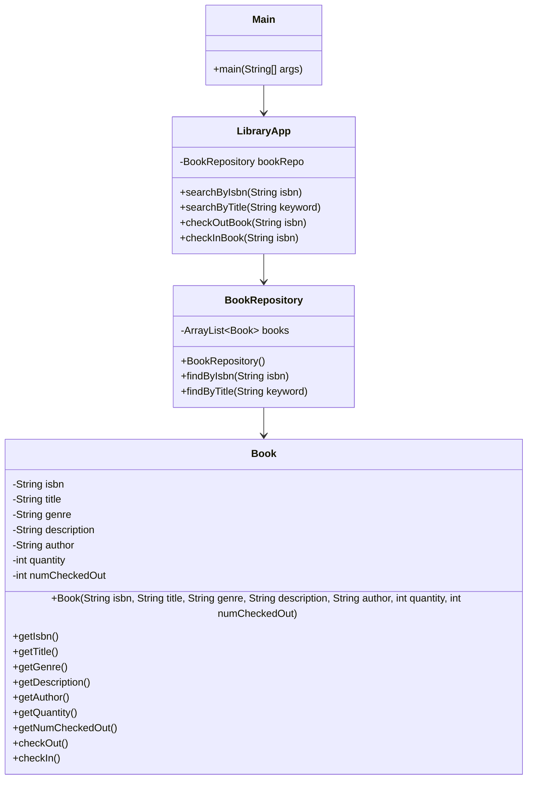

# Library App 📚

**Developed by** **`Grace Chen Abudi`** 👩🏽‍💻

## 📣 Overview:

- [Library App](#library-app-)
    - [📣 Overview:](#-overview)
    - [🔎 Intro:](#-intro)
    - [🧰 Tech Stack:](#-tech-stack)
    - [🏗️ Architecture Overview:](#-architecture-overview)
      - [🗝️ Key Components Include:](#-key-components-include)
      - [🔄 Interactions:](#-interactions)
      - [📚 Inclusion Summary:](#-inclusion-summary)
    - [✨ How to Get Started:](#-how-to-get-started)
      - [Prerequisites:](#prerequisites)
      - [🚀 Setup Instructions:](#-setup-instructions)
      - [🎮 Usage:](#-usage)

---

## 🔎 Intro:

This application will keep track of books that get checked in and out of the library, 
as well as allow the user to perform searches for books based on criteria such as titles 
with a certain word in, by the name of the author, or by the number of pages, etc... 
This application is developed in **```JAVA```**.

## 🧰 Tech Stack:

- JAVA

---

# 🏗️ Architecture Overview:



### 🗝️ Key Components Include:

1. **_<ins>Main:</ins>_** This class serves as the entry point for the application. 
  It initializes the **LibraryApp** instance and invokes the **searchByIsbn** method with various ISBNs
  to demonstrate the application's functionality.
2. **_<ins>LibraryApp:</ins>_** This class acts as the core of the application. 
  It contains a reference to **BookRepository** and provides the **searchByIsbn** method, which is used to
  search for books based on their ISBNs.
3. **_<ins>BookRepository:</ins>_** This class simulates a data source containing a collection of books. 
  It provides the **findByIsbn** method, which searches through the list of books and returns the book
  that matches the given ISBN.
4. **_<ins>Book:</ins>_** This class represents the data model for a book. It includes properties such
   as **isbn**, **title**, **genre**, **description**, and **author**, along with their respective getters.


### 🔄 Interactions:

1. **```Initialization:```**
   - The **Main** class creates an instance of **LibraryApp**.
2. **```Search Operations:```**
   - The **LibraryApp** class uses the **BookRepository** to search for books by ISBN. It prints details
   about the book if found, or indicates that no book was found.
   - The **BookRepository** class contains a list of **Book** objects and searches its collection and
     returns the results to LibraryApp.
3. **```Check Out/In Operations:```**
   - **LibraryApp** calls **BookRepository**'s **findByIsbn** to locate a book.
   - Once a book is found, **LibraryApp** calls the book's **checkOut** or **checkIn** method to
     update its status.
   - The **Book** class manages its own quantity and checked-out status.
- The **Book** class is used by **BookRepository** to encapsulate book information and provide access
  through getter methods.


### 📚 Inclusion Summary:

This simple library application demonstrates the use of object-oriented principles in Java, 
including encapsulation and composition.
The **Main** class drives the application by invoking methods on the **LibraryApp** class, 
which in turn interacts with **BookRepository** to fetch data about **Book** objects.
Each component has a specific responsibility, making the application modular and easy to maintain.
The architecture is designed to be both simple and comprehensive, including:

  - **```Main:```** The entry point of the application.
  - **```LibraryApp:```** The core class handling application logic.
  - **```BookRepository:```** The data management class.
  - **```Book:```** The class representing individual book items.

This modular design ensures clarity, ease of maintenance, and scalability.
The architecture can be easily extended to include additional functionality, such as adding new books,
searching by other criteria, or integrating with a database instead of a static list.


---

# ✨ How to Get Started:

### **```Prerequisites:```**

Ensure you have the following installed on your system:

  - [Java Development Kit (JDK)](https://www.oracle.com/java/technologies/downloads/#java11)
  - An Integrated Development Environment (IDE) such as [IntelliJ IDEA](https://www.jetbrains.com/idea/download/?section=mac) 
    or [Eclipse](https://www.eclipse.org/)

---

### 🚀 Setup Instructions:

**```1.```** **Clone the Repository:**
```bash

git clone https://github.com/Chen-Abudi/library-app-java.git

```

**```2.```** **Navigate to the Project Directory:**

```bash

cd libapp

```

**```3.```** **Open the Project in Your IDE:**
  - Open your IDE and select the "Open Project" option.
  - Navigate to the **libapp** directory and open it.

**```4.```** **Build the Project:**
  - Ensure that your IDE recognizes the project as a Java project.
  - Build the project to ensure all dependencies and configurations are correctly set up.

---

### 🎮 Usage:

**```1.```** **Run the Application:**
  - Locate the **Main** class in the **libapp** package.
  - Right-click on the **Main** class and select **Run 'Main.main()'**.

**```2.```** **Search for Books by ISBN:**
  - The **LibraryApp** instance allows you to search for books by their ISBN.
  - Call the **searchByIsbn(String isbn)** method with the desired ISBN.

    ***Example:***
```bash

app.searchByIsbn("83471");

```

**```3.```** **Search for Books by Title:**
  - You can also search for books by a keyword in their title.
  - Call the **searchByTitle(String keyword)** method with the desired keyword.

    ***Example:***
```bash

app.searchByTitle("Castle");

```

**```4.```** **Check Out a Book:**
  - To check out a book, call the **checkOutBook(String isbn)** method with the book's ISBN.

    ***Example:***
```bash

app.checkOutBook("83471");

```

**```5.```** **Check In a Book:**
  - To check in a book, call the **checkInBook(String isbn)** method with the book's ISBN.

    ***Example:***
```bash

app.checkInBook("83471");

```

