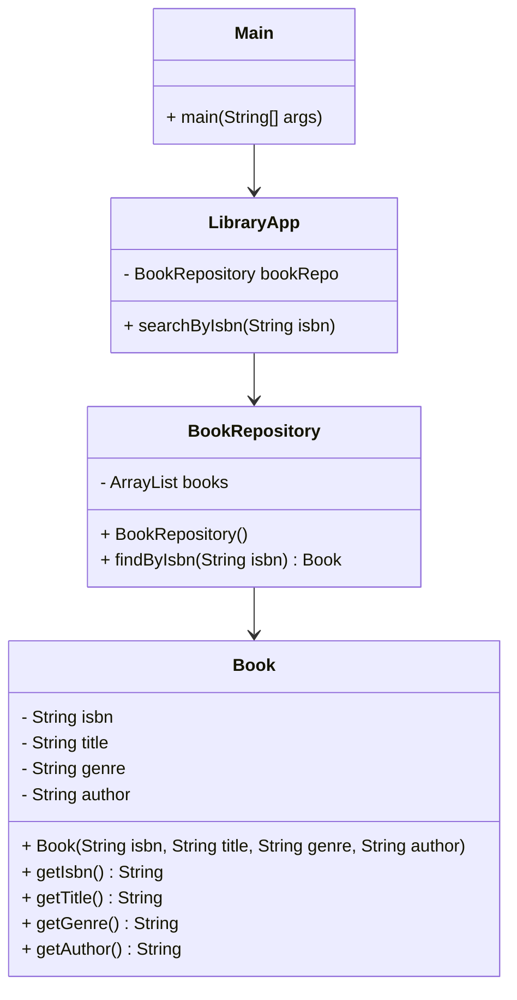

# Library App 📚

**Developed by** **`Grace Chen Abudi`** 👩🏽‍💻

## 📣 Overview:

- [Library App](#library-app-)
    - [📣 Overview:](#-overview)
    - [🔎 Intro:](#-intro)
    - [🧰 Tech Stack:](#-tech-stack)
    - [🏗️ Architecture Overview:](#-architecture-overview)
      - [🗝️ Key Components Include:](#-key-components-include)
      - [🔄 Interactions:](#-interactions)
      - [📚 Inclusion Summary:](#-inclusion-summary)
    - [✨ How to Get Started:](#-how-to-get-started)

---

## 🔎 Intro:

This application will keep track of books that get checked in and out of the library, 
as well as allow the user to perform searches for books based on criteria such as titles 
with a certain word in, by the name of the author, or by the number of pages, etc... 
This application is developed in **```JAVA```**.

## 🧰 Tech Stack:

- JAVA

---

# 🏗️ Architecture Overview:



### 🗝️ Key Components Include:

1. **_<ins>Main:</ins>_** This class serves as the entry point for the application. 
  It initializes the **LibraryApp** instance and invokes the **searchByIsbn** method with various ISBNs
  to demonstrate the application's functionality.
2. **_<ins>LibraryApp:</ins>_** This class acts as the core of the application. 
  It contains a reference to **BookRepository** and provides the **searchByIsbn** method, which is used to
  search for books based on their ISBNs.
3. **_<ins>BookRepository:</ins>_** This class simulates a data source containing a collection of books. 
  It provides the **findByIsbn** method, which searches through the list of books and returns the book
  that matches the given ISBN.
4. **_<ins>Book:</ins>_** This class represents the data model for a book. It includes properties such
   as **isbn**, **title**, **genre**, **description**, and **author**, along with their respective getters.


### 🔄 Interactions:

- The **Main** class creates an instance of **LibraryApp** and calls the **searchByIsbn** method three
  times with different ISBNs.
- The **LibraryApp** class uses the **BookRepository** to search for books by ISBN. It prints details
  about the book if found, or indicates that no book was found.
- The **BookRepository** class contains a list of **Book** objects and iterates through this list to
  find a book with a matching ISBN.
- The **Book** class is used by **BookRepository** to encapsulate book information and provide access
  through getter methods.


### 📚 Inclusion Summary:

This simple library application demonstrates the use of object-oriented principles in Java, 
including encapsulation and composition.
The **Main** class drives the application by invoking methods on the **LibraryApp** class, 
which in turn interacts with **BookRepository** to fetch data about **Book** objects.
Each component has a specific responsibility, making the application modular and easy to maintain.
This architecture can be easily extended to include more functionality, such as adding new books, 
searching by other criteria, or interacting with a database instead of a static list.

---

# ✨ How to Get Started:

